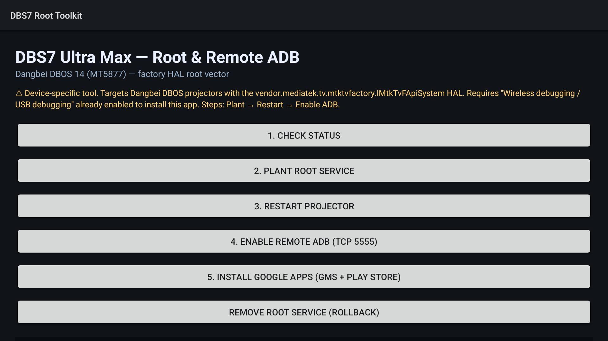
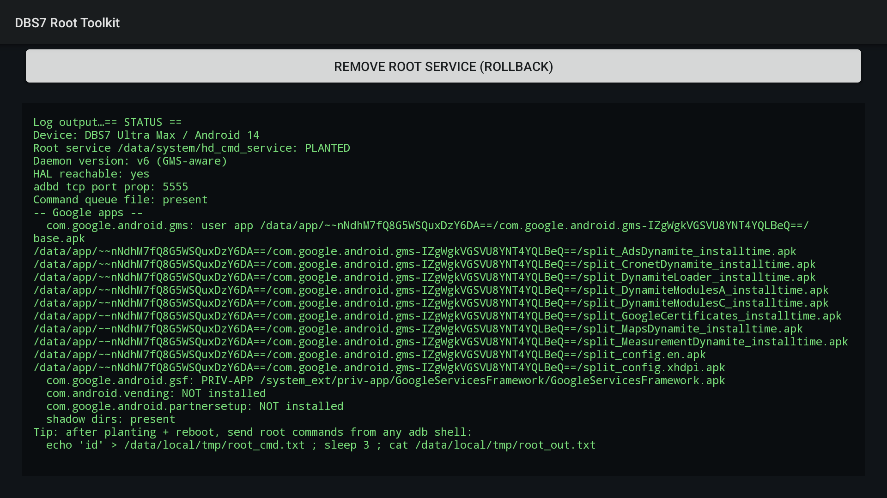

# DBS7 Root Toolkit

One-tap **root + remote ADB + Google apps (GMS / Play Store)** installer for
Dangbei DBOS 14 projectors (tested on **DBS7 Ultra Max**, MediaTek MT5877).

A single ~21 KB Android app, no dependencies. Install it straight from a USB
stick (no PC needed) and follow three buttons. The whole UI is English.

<p align="center">
  
  
</p>

> [!WARNING]
> Device-specific research tool. Only works on DBOS firmware that ships the
> `vendor.mediatek.tv.mtktvfactory.IMtkTvFApiSystem` factory HAL with SELinux
> permissive (DBOS factory default). Rooting may violate your warranty and local
> law; you are responsible for both. Nothing on read-only partitions
> (EROFS/dm-verity) is ever modified — everything is planted in `/data` and can
> be fully rolled back from the app.

## What it does

| Button | Action |
|---|---|
| 1. Check status | Device model, factory-HAL reachability, root-service state, per-package GMS status (priv-app / user app / missing) |
| 2. Plant root service | Writes the root daemon to `/data/system/hd_cmd_service` through the factory HAL, chmods it, pre-creates the command queue |
| 3. Restart projector | Reboots via the root daemon queue (or directly when allowed) |
| 4. Enable remote ADB | Forces `persist.adb.tcp.port=5555` + restarts adbd (re-asserted at every boot by the daemon) |
| 5. Install Google apps | Stages GmsCore / GSF / Play Store into a **priv-app shadow** + permission allowlists, upgrades the daemon, queues the bind-mounts |
| 5b. Stage Google apps from USB | Copies `gapps/` from a USB stick into `/data/local/tmp/gapps` as root (no adb needed) |
| Remove root service | Full rollback: removes the daemon and queue files |

Typical flow: **1 → 2 → 3** (status, plant, restart). After the reboot the
daemon runs **as root** — init executes it at every boot. From any machine on
the LAN:

```bash
adb connect <projector-ip>:5555
adb shell "echo 'id' > /data/local/tmp/root_cmd.txt; sleep 3; cat /data/local/tmp/root_out.txt"
# → uid=0(root) ... — you have a root command channel
```

## The root vector (verified live end-to-end)

1. **Factory HAL binder service** —
   `vendor.mediatek.tv.mtktvfactory.IMtkTvFApiSystem/default` runs as SYSTEM uid
   and exposes file primitives over binder. With SELinux permissive **any app
   can call it**; the app just runs `service call ...` via `Runtime.exec`:
   - `tx#1` `change_file_mode(path, mode)` — chmod; **mode is parsed DECIMAL**
     (bug: pass `448` for `0700`, `438` for `0666`)
   - `tx#2` `check_file(path)` — exists probe (reply `00000000` = exists)
   - `tx#5` `create_file(path)`
   - `tx#13` `remove_file(path)`
   - `tx#17` `write_file(path, data, append, ?)` — write/append, multiline OK
2. **init service `hd_cmd_server`** (`/vendor/bin/hd_deamon_cmd_server.sh`,
   class `main`, **user root**) checks `-f /data/system/hd_cmd_service` at every
   boot and, if present, `chmod 700` + **executes it as root**. Any script
   planted there = persistent root.
3. **Planted daemon** = root command channel + self-healing bind-mounts:
   - reads line 1 of `/data/local/tmp/root_cmd.txt`, executes it as root,
     appends output to `root_out.txt`
   - re-asserts `persist.adb.tcp.port=5555` and restarts adbd at every boot
   - idempotent bind-mounts (only when their source exists):
     - EN-patched `LeradSettings.apk` over `/system/priv-app/LeradSettings`
     - GMS priv-app shadow over `/system_ext/priv-app` and
       `/system_ext/etc/permissions`

## Google apps (GMS + Play Store)

`/system`, `/system_ext` and `/product` are read-only, so Google apps cannot be
installed as privileged system apps the normal way — and as ordinary
`/data/app` packages GmsCore/GSF crash with `READ_DEVICE_CONFIG` and friends
(signature|privileged permissions). The toolkit solves this with a
**priv-app shadow**:

1. Stage 8 files in `/data/local/tmp/gapps/` (MindTheGapps 14 arm64 provides
   GmsCore / GSF / Feedback / PartnerSetup; **Play Store must be the Android TV
   build** — the phone build ANR-loops on `leanback_only` devices).

   **Where to get the files** — they are not distributed here (Google
   copyright; download from the official sources):

   - **`tools/download_gapps.sh`** (Linux/macOS):
     downloads MindTheGapps 14.0.0 arm64 from the official
     [MindTheGapps releases](https://github.com/MindTheGapps/14.0.0-arm64/releases)
     (sha256-verified), extracts the 5 APKs + 3 permission XMLs into `gapps/`,
     and tells you where to fetch the TV Play Store (APKMirror, needs a
     browser). Run: `tools/download_gapps.sh .`
   - Then either **adb** (below) or the **USB route**: put the `gapps/` folder
     on a FAT32 stick, plug it in, press **5b. Stage Google apps from USB**
     (after root is planted) — the daemon copies the files as root, no PC
     needed.

   ```bash
   adb push GmsCore.apk GoogleServicesFramework.apk GoogleFeedback.apk \
            GooglePartnerSetup.apk PlayStoreTV.apk \
            privapp-permissions-google-product.xml \
            privapp-permissions-google-system-ext.xml \
            privapp-permissions-mtg.xml /data/local/tmp/gapps/
   ```

2. Press **5. Install Google apps** — the app verifies all 8 files through the
   HAL, then queues a root command that builds the shadows:
   - `/data/local/tmp/gapps/sext_privapp_shadow/` = full copy of
     `/system_ext/priv-app` **plus** `GmsCore/`, `GoogleServicesFramework/`,
     `GoogleFeedback/`, `GooglePartnerSetup/`, `Phonesky/` (Play Store)
   - `/data/local/tmp/gapps/sext_perm_shadow/` = copy of
     `/system_ext/etc/permissions` **plus** the `privapp-permissions-*.xml`
     allowlists (privapp permission XMLs must live on the **same partition**
     as the priv-apps they allowlist — hence the shadow covers both dirs)
3. Press **3. Restart projector** — PackageManager rescans `/system_ext/priv-app`
   (now the shadow) and registers GmsCore/GSF/Play Store as **privileged apps**
   with their signature permissions granted from the allowlists.
4. Open **Play Store** → sign in with a Google account. Verified live: all
   packages land in `/system_ext/priv-app/`, `com.google.android.gms.persistent`
   stays up, Play Store TV 48.4.15 boots to the storefront and browses/installs
   apps normally.

Rollback: remove the two bind-mounts through the root queue, delete the shadow
dirs, restart. Or press **Remove root service** for the full rollback.

## Install & build

### Option A — USB stick (no PC needed)

1. Download `DBS7RootToolkit-v1.0.apk` (from the
   [releases page](https://github.com/Hubert-Rybak/dbs7-root-toolkit/releases))
   and copy it to the **root of a FAT32 USB stick**.
2. On the projector open the built-in **File Manager** (Media Center), select
   the USB drive and click the APK. If install from unknown sources is
   blocked, allow it when prompted (Settings → Security → Unknown sources).
3. Open **DBS7 Root Toolkit** from the launcher and continue with
   **1 → 2 → 3** (see *What it does* above).

> [!TIP]
> Dangbei DBOS also ships a factory USB auto-installer: an APK placed on the
> stick can be picked up and installed silently at boot on some firmware
> versions. The File Manager route above always works and needs no reboot —
> try it first.

### Option B — ADB (USB debugging already enabled)

```bash
adb install DBS7RootToolkit-v1.0.apk
adb shell am start -n com.dbs7.rootkit/.MainActivity
```

Building from source — no gradle:

```bash
tools/build.sh   # needs android.jar (API 34), build-tools (aapt2, d8, apksigner), JDK 17
```

Pipeline: `aapt2 compile/link → javac → d8 → zip → apksigner`. You will need to
generate your own signing keystore (`tools/build.sh` creates one automatically
if missing) — the APK must be signed to install.

## Troubleshooting

| Symptom | Cause / fix |
|---|---|
| `HAL reachable: no` | Different firmware/HAL name — check `service list \| grep mtktvfactory` over ADB and adjust the service name in `MainActivity` |
| Status shows `PLANTED` but no root output | Daemon from an older run — press *Remove root service*, restart, plant again |
| `adb connect` fails after step 4 | adbd restart drops connections for ~2 s — retry; check `getprop persist.adb.tcp.port` = 5555 |
| App says *not planted* right after planting | init only execs the file at **boot** — press *Restart projector* |
| Reboot button does nothing | Apps cannot reboot directly on this firmware; the fallback routes through the root queue, so plant first |
| Play Store ANRs after restart | Phone-build Play Store on a `leanback_only` device — use the **Android TV** build (`TvMainActivity`) |
| GmsCore/GSF crash-loop with `READ_DEVICE_CONFIG` | They are installed as user apps — the shadow bind + restart is what makes them privileged |
| Play Store boots to a black screen | Screensaver/TV-input grabbed the foreground — press HOME and relaunch |

## Repository context

This app condenses the root chain documented in the (private) research repo:

- `docs/ROOT_VECTOR_HD_CMD_SERVICE.md` — factory HAL binder transactions and the
  `hd_cmd_server` init hook
- `docs/FACTORY_USB_EXEC_CHAIN.md` — the alternative USB-trigger chain
- `docs/PERSISTENT_FOOTHOLD.md` — persistence and operational caveats

## File map

```
app/src/main/AndroidManifest.xml                     exported activity, no dangerous permissions
app/src/main/java/com/dbs7/rootkit/MainActivity.java all logic: HAL calls + daemon + GMS installer
app/src/main/res/layout/activity_main.xml            dark TV-friendly single-scroll layout
app/src/main/res/values/strings.xml                  EN strings (whole UI is English)
tools/build.sh                                       aapt2 → javac → d8 → zip → apksigner (no gradle)
tools/download_gapps.sh                              fetch MindTheGapps (official, sha256) + Play Store TV → gapps/
screenshots/                                         app UI on the device
DBS7RootToolkit-v1.0.apk                             signed, ready to install
```

## Security notes

- The daemon executes whatever appears in `root_cmd.txt` **as root** — treat
  that file as sensitive (anything with ADB access to the device can use it).
- Remote ADB on TCP 5555 without authentication is implied by the workflow —
  use only on trusted LANs.
- Do not use while a factory-test USB stick with `dangs_factory_test_*` files
  is plugged in (separate trigger chain).
- GMS runs without Google device certification: Play Protect will warn that the
  device is uncertified. Device registration (GSF id) is out of scope here.

## License / use

Provided as-is for device owners and researchers. You are responsible for
complying with local law and your warranty terms.
